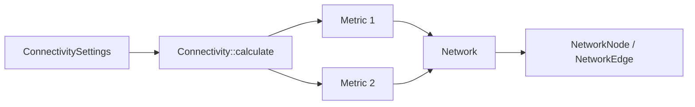

# Connectivity

The Connectivity library (`CONNECTIVITYLIB`) computes functional connectivity metrics, stores the resulting networks, and provides graph-theoretic utilities. It is implemented in pure C++ with real-time capability in mind and imposes no modality-specific constraints — the same API works for MEG, EEG, and source-level data.

## Architecture

The library is organized into three groups of classes:

| Group | Key Classes | Role |
|-------|-------------|------|
| **API** | `Connectivity`, `ConnectivitySettings` | User-facing entry point — configure inputs, select metrics, launch computation |
| **Metrics** | One class per metric (e.g., `ConnectivityPLI`) | Implement the spectral/statistical estimator for each measure |
| **Network containers** | `Network`, `NetworkNode`, `NetworkEdge` | Store and query the resulting connectivity graph |

### Data Flow



1. The user populates a `ConnectivitySettings` object with trial data, node positions, desired metrics, and sampling frequency.
2. `Connectivity::calculate()` dispatches each requested metric to its dedicated class.
3. Results are returned as one `Network` per metric, containing `NetworkNode` and `NetworkEdge` objects.

`NetworkEdge` instances are stored as smart pointers, which keeps memory usage manageable for large, fully connected graphs. `Network` also exposes functions for distance-matrix computation, basic graph measures, and weight-based thresholding.

### Trial-Based Computation

Connectivity is computed **across trials**, not across time. This design targets evoked-response experiments where data are segmented into stimulus-locked epochs. For resting-state recordings (no stimulus), the continuous data can be split into equally sized blocks and treated as pseudo-trials — a standard approach in resting-state connectivity studies.

:::note
Time-resolved (sample-by-sample) connectivity is not currently supported. Use the trial-based approach for spontaneous data.
:::

## Usage

The example below computes all-to-all Phase Lag Index (PLI) and Imaginary Coherence from MEG gradiometer epochs:

```cpp
// Prepare input data
FiffRawData raw("sample_audvis_raw.fif");
RowVectorXi picks = raw.info.pick_types("grad");
Eigen::MatrixXi events;
MNE::read_events("sample_audvis_raw-eve.fif", events);

// Read epochs: -100 ms to 400 ms relative to event type 3
MNEEpochDataList data;
data = MNEEpochDataList::readEpochs(raw, events, -0.1, 0.4, 3, picks);

// Configure connectivity
ConnectivitySettings settings;
settings.setNodePositions(raw.info, picks);
settings.setConnectivityMethods(QStringList() << "pli" << "imagcohy");
settings.setSamplingFrequency(raw.info.sfreq);
for (MNEEpochData::SPtr pItem : data)
    settings.append(pItem->epoch);

// Compute — returns one Network per metric
QList<Network> networks = Connectivity::calculate(settings);
```

Source-level connectivity works identically — pass source-localized signals instead of sensor-level data.

## Supported Metrics

| Metric | Keyword | Domain |
|--------|---------|--------|
| Correlation | `cor` | Time |
| Cross-Correlation | `xcor` | Time |
| Coherence | `coh` | Frequency |
| Imaginary Coherence | `imagcohy` | Frequency |
| Phase Locking Value | `plv` | Phase |
| Phase Lag Index | `pli` | Phase |
| Weighted Phase Lag Index | `wpli` | Phase |
| Unbiased Squared Phase Lag Index | `uspli` | Phase |
| Debiased Squared Weighted Phase Lag Index | `dswpli` | Phase |
