# Disp3D — RHI-Based 3D Visualization

Starting with MNE-CPP v2.0, the 3D visualization library has been rebuilt on top of Qt's **Rendering Hardware Interface (RHI)**. The library is now called `disp3D_rhi` (namespace `DISP3DRHILIB`). Unlike the previous Qt3D-based implementation, the RHI backend talks directly to the platform's native graphics API — Metal on macOS, Vulkan on Linux, Direct3D 11/12 on Windows, or OpenGL as a fallback — giving MNE-CPP a thinner, more portable rendering stack.

:::info Why RHI?
Qt3D provided a high-level scene-graph but added significant abstraction overhead. With RHI, the library manages its own render pipeline, vertex buffers, and shader programs directly, resulting in lower latency, smaller binary size, and better control over GPU resource lifetime — all critical for real-time neuroimaging visualization.
:::

## Architecture Overview

The library follows a clean separation of concerns inspired by several well-known software patterns:

- **Model–View separation** — The `BrainTreeModel` (a `QStandardItemModel`) owns all scene data and metadata. `BrainView` reads the model to decide *what* to show; `BrainRenderer` decides *how* to draw it. Neither the model nor the renderer know about each other directly — `BrainView` acts as the mediator.
- **Retained-mode rendering** — Renderable objects (`BrainSurface`, `DipoleObject`, `NetworkObject`, `SourceEstimateOverlay`) each own their GPU resources (vertex buffers, index buffers, instance buffers, uniform buffers). They create these resources once on initialization and only update the data that changes per frame (e.g., vertex colors for a new time sample). This avoids per-frame allocation and keeps draw calls cheap.
- **Strategy pattern for shaders** — The `BrainRenderer` maintains a set of pre-compiled shader pipelines (`Standard`, `Holographic`, `Anatomical`, `Dipole`, `XRay`, `ShowNormals`). Switching visual style is a pipeline swap, not a recompilation.
- **Observer / worker pattern** — Real-time data (sensor streams, source estimates) flows through dedicated `QObject`-based workers running on background threads. Workers emit signals carrying per-vertex color arrays, which `BrainView` applies to the appropriate renderable before the next draw call. This keeps the render thread free from heavy computation.
- **Composition over inheritance** — Rather than deep inheritance hierarchies (as in the old Qt3D design where every renderable was a `QEntity` subclass), the RHI design composes independent objects: a `BrainSurface` is *not* a widget or an entity — it is a plain C++ object that knows how to upload geometry and draw itself when asked.

```mermaid
%%{init: {'theme': 'base', 'themeVariables': {'fontSize': '14px'}}}%%
graph LR
    classDef view fill:#4A90D9,stroke:#2E6BA6,color:#fff,rx:8,ry:8
    classDef engine fill:#E8833A,stroke:#C06A2E,color:#fff,rx:8,ry:8
    classDef renderable fill:#7B68EE,stroke:#5B48CE,color:#fff,rx:8,ry:8
    classDef model fill:#50B86C,stroke:#3A9252,color:#fff,rx:8,ry:8
    classDef core fill:#9E9E9E,stroke:#757575,color:#fff,rx:8,ry:8
    classDef input fill:#F5A623,stroke:#D4891A,color:#fff,rx:8,ry:8
    classDef scene fill:#E05D6F,stroke:#B8404F,color:#fff,rx:8,ry:8
    classDef worker fill:#8D6E96,stroke:#6E4F77,color:#fff,rx:8,ry:8

    subgraph VIEW [" View Layer "]
        direction TB
        BV["🖥️ BrainView<br/><i>QRhiWidget</i>"]:::view
        MVL["◫ MultiViewLayout<br/><i>1–4 viewports</i>"]:::view
    end

    subgraph ENGINE [" Render Engine "]
        direction TB
        BR["⚙️ BrainRenderer<br/><i>pipelines · draw calls</i>"]:::engine
        SH["🎨 GLSL Shaders<br/><i>6 visual modes</i>"]:::engine
    end

    subgraph REND [" Renderable Objects "]
        direction TB
        BS["🧠 BrainSurface<br/><i>cortical · BEM mesh</i>"]:::renderable
        DO["📍 DipoleObject<br/><i>instanced cones</i>"]:::renderable
        NO["🔗 NetworkObject<br/><i>nodes · edges</i>"]:::renderable
        SEO["📊 SourceEstimateOverlay<br/><i>STC amplitude</i>"]:::renderable
    end

    subgraph MDL [" Data Model "]
        direction TB
        BTM["🌳 BrainTreeModel<br/><i>QStandardItemModel</i>"]:::model
        ITEMS["SurfaceTreeItem · BemTreeItem<br/>DigitizerTreeItem · DipoleTreeItem<br/>NetworkTreeItem · SourceSpaceTreeItem"]:::model
    end

    subgraph CORE [" Core "]
        direction TB
        RT["RenderTypes<br/><i>ShaderMode · VisualizationMode</i>"]:::core
        VS["ViewState<br/><i>per-pane visibility</i>"]:::core
        DL["DataLoader"]:::core
    end

    subgraph INP [" Input "]
        direction TB
        CC["🎥 CameraController<br/><i>orbit · zoom · pan</i>"]:::input
        RP["🎯 RayPicker<br/><i>ray–triangle intersection</i>"]:::input
    end

    subgraph SCENE [" Scene Managers "]
        direction TB
        SFM["SensorFieldMapper"]:::scene
        SEM["SourceEstimateManager"]:::scene
        RSSM["RtSensorStreamManager"]:::scene
    end

    subgraph WORK [" Background Workers "]
        direction TB
        W1["RtSensorDataWorker"]:::worker
        W2["RtSensorInterpolationMatWorker"]:::worker
        W3["RtSourceDataWorker"]:::worker
        W4["StcLoadingWorker"]:::worker
    end

    BV --> MVL
    BV --> BR
    BV --> CC
    BV --> RP
    BR --> SH
    BR --> BS
    BR --> DO
    BR --> NO
    BR --> SEO
    BV --> BTM
    BTM --> ITEMS
    BV --> SFM
    BV --> SEM
    BV --> RSSM
    RSSM --> W1
    RSSM --> W2
    SEM --> W3
    SEM --> W4
```



### Key Differences from the Qt3D Implementation

| Aspect | Qt3D (v1.x) | RHI (v2.0) |
|--------|-------------|------------|
| **Widget base** | Custom `QWidget` + `QSurface3DFormat` | `QRhiWidget` |
| **Render control** | Qt3D framegraph / scenegraph | Direct `QRhi` pipeline + command buffer |
| **Shader language** | GLSL via Qt3D materials | GLSL compiled per-backend by Qt RHI |
| **Data model** | `Data3DTreeModel` + `Renderable3DEntity` → `QEntity` | `BrainTreeModel` + `BrainSurface` / `DipoleObject` / `NetworkObject` |
| **Multi-view** | Not built-in | `MultiViewLayout` with 1–4 panes |
| **Instanced rendering** | `GeometryMultiplier` | Native QRhi instance buffers |
| **Vertex picking** | Not implemented | `RayPicker` with CPU ray–triangle intersection |
| **Graphics backends** | OpenGL only | Metal, Vulkan, D3D 11/12, OpenGL |

## Module Breakdown

### View Layer

The view layer implements the **Mediator pattern** — `BrainView` sits between user input, the data model, and the renderer, coordinating their interactions without letting them reference each other directly.

- **`BrainView`** — The top-level widget, inheriting from `QRhiWidget` (Qt's portable RHI surface widget). On each frame, Qt calls `BrainView::render()`, which assembles a `SceneData` struct containing the current MVP matrix, camera position, light direction, and overlay mode, then hands it to `BrainRenderer` for drawing. `BrainView` also handles all mouse/keyboard events and dispatches them to the `CameraController` (for orbit/zoom/pan) or `RayPicker` (for vertex selection). It supports two modes: `SingleView` with an interactive orbiting camera, and `MultiView` with up to four fixed-angle viewports (e.g., top, left, front, free).
- **`MultiViewLayout`** — A pure-geometry helper with no widget dependencies. It stores fractional split positions and computes viewport rectangles, splitter hit-testing, and minimum pane sizes. `BrainView` queries this class for the pixel rectangles of each pane before issuing scissored draw calls. The layout supports 1, 2, 3, or 4 panes with draggable separators.

### Render Engine

The render engine is where the **Strategy pattern** is most visible. `BrainRenderer` holds a map of pre-compiled `QRhiGraphicsPipeline` objects — one per `ShaderMode` — and selects the appropriate pipeline at draw time.

- **`BrainRenderer`** — The low-level workhorse. It creates and caches `QRhiGraphicsPipeline` objects, manages shared uniform buffers (for the scene-wide MVP and lighting data), and iterates over all visible renderables to issue draw calls. Each renderable provides its own vertex/index/instance buffers; `BrainRenderer` simply binds them and calls `drawIndexed()` or `draw()`. The renderer is stateless between frames — all per-frame data arrives via the `SceneData` struct, making it easy to render the same scene from multiple camera angles (multi-view).
- **GLSL Shaders** — Six shader programs, each consisting of a `.vert` and `.frag` file. Qt's RHI layer compiles these at load time into the native shading language of the active backend (Metal Shading Language, SPIR-V for Vulkan, HLSL for D3D, or GLSL for OpenGL). The shaders receive per-vertex attributes (position, normal, packed ABGR color, packed ABGR annotation color) and a uniform block with the scene data. The `overlayMode` uniform controls which color channel the fragment shader samples — surface, annotation, scientific colormap, or source estimate.

| Shader | Visual Style |
|--------|-------------|
| `standard` | Phong lighting (default) |
| `holographic` | Two-sided holographic effect |
| `anatomical` | Curvature-based coloring |
| `dipole` | Dipole cone rendering |
| `xray` | Semi-transparent x-ray |
| `shownormals` | Surface-normal visualization |

### Renderable Objects

Renderables follow the **Self-Contained Resource** pattern — each object manages the full lifecycle of its GPU resources (creation, update, destruction) and exposes a uniform interface (`initResources()`, `updateResources()`, `draw()`) that `BrainRenderer` calls. This keeps the renderer agnostic about data types.

| Class | Purpose | GPU Resources |
|-------|---------|---------------|
| `BrainSurface` | Cortical or BEM mesh with per-vertex curvature, annotation, and STC color channels | Vertex buffer (`VertexData`: pos, normal, ABGR base, ABGR annotation), index buffer, uniform buffer |
| `DipoleObject` | Equivalent current dipoles rendered as instanced cones pointing in the moment direction | Shared cone geometry + per-instance transform/color buffer |
| `NetworkObject` | Connectivity graph — nodes as instanced spheres (diameter ∝ degree), edges as instanced cylinders (diameter and color ∝ weight) | Shared sphere/cylinder geometry + per-instance transform/color buffers |
| `SourceEstimateOverlay` | Per-vertex STC amplitude overlay streamed onto a `BrainSurface` | Updates the host surface's vertex color channel in-place |

The `VertexData` struct deserves special mention. It packs four attributes into a compact interleaved layout:

```cpp
struct VertexData {
    QVector3D pos;              // vertex position
    QVector3D norm;             // vertex normal
    uint32_t  color;            // curvature / base color   (ABGR packed)
    uint32_t  colorAnnotation;  // annotation region color  (ABGR packed)
};
```

Colors are stored as packed `uint32_t` values (`packABGR()`) rather than `QVector4D` floats, halving the per-vertex color footprint — a meaningful saving for high-resolution cortical meshes with 160 000+ vertices.

### Data Model

The data model applies the **Composite pattern** via Qt's `QStandardItemModel` tree structure. Every scene object is represented as a tree item; parent items group children logically (subject → hemisphere → surface, or subject → measurement → network). The tree can be displayed in a `QTreeView` to give users interactive visibility toggles, color pickers, and threshold sliders without any custom widget work.

Crucially, tree items in the RHI design are **not** renderables. In the old Qt3D design, `Renderable3DEntity` *was* a `QEntity` — the data model and the scenegraph were one and the same. In the RHI design, tree items are pure data/metadata containers. `BrainView` reads the model to decide which `BrainSurface`, `DipoleObject`, or `NetworkObject` instances should be visible, then passes them to `BrainRenderer`. This separation makes it straightforward to render the same data in multiple viewports with different visibility profiles.

| Tree Item | Data Source |
|-----------|-----------|
| `SurfaceTreeItem` | FreeSurfer surface + annotation |
| `BemTreeItem` | BEM compartment surface |
| `DigitizerTreeItem` / `DigitizerSetTreeItem` | HPI, fiducials, head-shape points |
| `DipoleTreeItem` | `ECDSet` |
| `NetworkTreeItem` | `Network` from the Connectivity library |
| `SourceSpaceTreeItem` | `MNESourceSpace` |

### Core

The core module provides shared types and state that every other module depends on, without pulling in heavy Qt or QRhi headers.

- **`RenderTypes`** — A lightweight header-only file defining `ShaderMode` and `VisualizationMode` enums and the `packABGR()` utility. It deliberately avoids any QRhi includes, so public API headers can use these enums without leaking GPU implementation details to downstream consumers.
- **`ViewState`** — Captures all per-viewport settings: camera orientation, lighting parameters, and a `ViewVisibilityProfile` struct with independent boolean toggles for each data layer (LH, RH, BEM head, BEM outer skull, BEM inner skull, MEG sensors, etc.). Each viewport in a multi-view layout carries its own `ViewState`, enabling pane-specific views of the same dataset.
- **`DataLoader`** — Centralized utilities for loading FreeSurfer surfaces, annotations, and BEM data into the model and creating the corresponding renderables.

### Input

Input handling is decoupled from the widget, following the **Strategy pattern** — `BrainView` delegates input interpretation to specialized objects rather than handling it in monolithic `mousePressEvent` overrides.

- **`CameraController`** — A widget-independent camera that takes mouse delta values and produces a `CameraResult` struct (projection, view, and model matrices, plus camera position and up vector). It supports orbiting around a focus point, dolly zoom, and panning. Because it has no widget dependency, it can compute matrices for any viewport rectangle, which is how multi-view rendering works — `BrainView` calls `CameraController` once per pane with different viewport sizes.
- **`RayPicker`** — Performs CPU-side ray–triangle intersection testing against all visible `BrainSurface` meshes. Given a mouse position and viewport rectangle, it unprojects a ray and walks the triangle list of each surface to find the closest intersection. The result is a `PickResult` carrying the hit point, surface key, vertex index, distance, and (if available) the FreeSurfer annotation region name and label ID. Dipole picking is also supported.

### Scene Managers

Scene managers encapsulate domain-specific logic that would otherwise bloat `BrainView`. Each manager owns the lifecycle of its workers and the mapping between raw data and renderable updates.

- **`SensorFieldMapper`** — Computes and caches the sparse interpolation matrix that maps sensor-level data (MEG channels or EEG electrodes) onto a scalp or helmet surface mesh. When new samples arrive, it multiplies the data vector by the interpolation matrix to produce per-vertex color values.
- **`SourceEstimateManager`** — Handles loading and streaming of MNE source estimates (STC files or real-time data). It manages the interpolation from source-space vertices to the high-resolution cortical surface mesh and drives the `SourceEstimateOverlay`.
- **`RtSensorStreamManager`** — Lifecycle manager for `RtSensorDataController`. It encapsulates the start/stop/configure cycle of real-time sensor streaming, keeping `BrainView` clean. Internally it manages `RtSensorDataWorker` and `RtSensorInterpolationMatWorker` on background threads.

### Background Workers

Workers implement the **Producer–Consumer pattern** on Qt's thread infrastructure. Each worker lives on a dedicated `QThread` and communicates with the main/render thread via queued signal–slot connections. This guarantees that heavy computation (interpolation matrix construction, per-vertex color mapping) never blocks the render loop.

| Worker | Role |
|--------|------|
| `RtSensorDataWorker` | Receives raw sensor samples, applies the interpolation matrix, and emits per-vertex color arrays ready for GPU upload |
| `RtSensorInterpolationMatWorker` | Builds the sparse interpolation matrix mapping sensor positions to surface vertices (recomputed when sensor geometry changes) |
| `RtSourceDataWorker` | Streams source-estimate samples and computes per-vertex STC colors |
| `RtSourceInterpolationMatWorker` | Builds the source-space interpolation matrix |
| `StcLoadingWorker` | Asynchronous STC file I/O — loads large `.stc` files without blocking the UI |

## Usage

### Quick Start — Visualizing a Brain Surface

```cpp
#include <disp3D_rhi/view/brainview.h>
#include <disp3D_rhi/model/braintreemodel.h>
#include <fs/surface.h>
#include <fs/annotation.h>

// Create view and model
BrainView *view = new BrainView();
BrainTreeModel *model = new BrainTreeModel();
view->setModel(model);

// Load FreeSurfer surfaces
FSLIB::Surface surfLh("sample", 0, "inflated", subjectsDir);
FSLIB::Surface surfRh("sample", 1, "inflated", subjectsDir);
model->addSurface("sample", "lh", "inflated", surfLh);
model->addSurface("sample", "rh", "inflated", surfRh);

// Load annotations
FSLIB::Annotation annotLh("sample", 0, "aparc", subjectsDir);
model->addAnnotation("sample", "lh", annotLh);

view->show();
```

### Adding a Connectivity Network

```cpp
#include <disp3D_rhi/model/braintreemodel.h>
#include <connectivity/network/network.h>

// After computing connectivity (see Connectivity library docs)
QList<Network> networks = Connectivity::calculate(settings);
model->addNetwork(networks.first(), "PLI");
```

## Shader Modes and Visualization Modes

The renderer supports multiple shader pipelines (`ShaderMode`) and surface overlay modes (`VisualizationMode`):

| ShaderMode | Effect |
|------------|--------|
| `Standard` | Default Phong shading |
| `Holographic` | Two-sided holographic effect |
| `Anatomical` | Curvature-based coloring |
| `Dipole` | Dipole cone rendering |
| `XRay` | Semi-transparent x-ray effect |
| `ShowNormals` | Surface normals as color |

| VisualizationMode | Vertex Color Source |
|-------------------|-------------------|
| `ModeSurface` | Curvature-derived gray tones |
| `ModeAnnotation` | Atlas / parcellation region colors |
| `ModeScientific` | Scientific colormap |
| `ModeSourceEstimate` | STC amplitude overlay |
