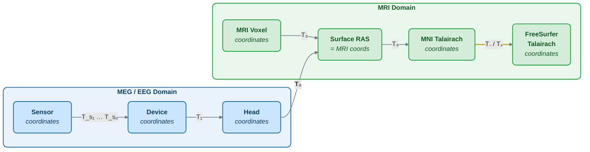

# The Forward Solution

This page covers the definitions of different coordinate systems employed in MNE software and FreeSurfer, the details of the computation of the forward solutions, and the associated low-level utilities.

## MEG/EEG and MRI Coordinate Systems

The coordinate systems used in MNE software (and FreeSurfer) and their relationships are described below. Except for the *sensor coordinates*, all of the coordinate systems are Cartesian and have the "RAS" (Right-Anterior-Superior) orientation, i.e., the $x$ axis points to the right, the $y$ axis to the front, and the $z$ axis up.

The following diagram shows the relationships between all coordinate systems and the transformations connecting them:

*Figure: MEG/EEG and MRI coordinate systems and the transformations between them. $T_1$ (Device → Head) is determined during MEG acquisition via HPI coils. $T_2$ (Head → MRI) is established during coregistration. $T_3$ and $T_4$ are provided by FreeSurfer.*

### Coordinate Systems Related to MEG/EEG Data

**Head coordinates**

This is a coordinate system defined with help of the fiducial landmarks (nasion and the two auricular points). In FIFF files, EEG electrode locations are given in this coordinate system. In addition, the head digitization data acquired in the beginning of an MEG, MEG/EEG, or EEG acquisition are expressed in head coordinates.

**Device coordinates**

This is a coordinate system tied to the MEG device. The relationship of the Device and Head coordinates is determined during an MEG measurement by feeding current to three to five head-position indicator (HPI) coils and by determining their locations with respect to the MEG sensor array from the magnetic fields they generate.

**Sensor coordinates**

Each MEG sensor has a local coordinate system defining the orientation and location of the sensor. With help of this coordinate system, the numerical integration data needed for the computation of the magnetic field can be expressed conveniently. The channel information data in the FIFF files contain the information to specify the coordinate transformation between the coordinates of each sensor and the MEG device coordinates.

### Coordinate Systems Related to MRI Data

**Surface RAS coordinates**

The FreeSurfer surface data are expressed in this coordinate system. The origin of this coordinate system is at the center of the conformed FreeSurfer MRI volumes (usually 256 × 256 × 256 isotropic 1-mm³ voxels) and the axes are oriented along the axes of this volume. The BEM surface and the locations of the sources in the source space are usually expressed in this coordinate system in the FIFF files. In this manual, the *Surface RAS coordinates* are usually referred to as *MRI coordinates* unless there is need to specifically discuss the different MRI-related coordinate systems.

**RAS coordinates**

This coordinate system has axes identical to the Surface RAS coordinates but the location of the origin is different and defined by the original MRI data, i.e., the origin is in a scanner-dependent location. There is hardly any need to refer to this coordinate system explicitly in the analysis with the MNE software. However, since the Talairach coordinates are defined with respect to *RAS coordinates* rather than the *Surface RAS coordinates*, the RAS coordinate system is implicitly involved in the transformation between Surface RAS coordinates and the two *Talairach* coordinate systems.

**MNI Talairach coordinates**

The MNI Talairach coordinate system provides a standard brain space. This transformation is determined during the FreeSurfer reconstruction process. These coordinates are in MNI305 space.

**FreeSurfer Talairach coordinates**

The problem with the MNI Talairach coordinates is that the linear MNI Talairach transform does not match the brains completely to the Talairach brain. This is because the Talairach atlas brain is a rather odd shape, and as a result, it is difficult to match a standard brain to the atlas brain using an affine transform. As a result, the MNI brains are slightly larger (in particular higher, deeper and longer) than the Talairach brain. The differences are larger as you get further from the middle of the brain, towards the outside. The FreeSurfer Talairach coordinates mitigate this problem by adding an additional transformation, defined separately for negative and positive MNI Talairach $z$ coordinates. These two transformations, denoted by $T_-$ and $T_+$, are fixed as follows:

$$
T_{-} = \begin{bmatrix}
0.99 & 0 & 0 & 0 \\
0 & 0.9688 & 0.042 & 0 \\
0 & -0.0485 & 0.839 & 0 \\
0 & 0 & 0 & 1
\end{bmatrix}
$$

$$
T_{+} = \begin{bmatrix}
0.99 & 0 & 0 & 0 \\
0 & 0.9688 & 0.046 & 0 \\
0 & -0.0485 & 0.9189 & 0 \\
0 & 0 & 0 & 1
\end{bmatrix}
$$

### Coordinate Transformations

The different coordinate systems are related by coordinate transformations. Generally:

$$
\begin{bmatrix} x_2 \\ y_2 \\ z_2 \\ 1 \end{bmatrix} = T_{12} \begin{bmatrix} x_1 \\ y_1 \\ z_1 \\ 1 \end{bmatrix} = \begin{bmatrix} R_{11} & R_{12} & R_{13} & x_0 \\ R_{21} & R_{22} & R_{23} & y_0 \\ R_{31} & R_{32} & R_{33} & z_0 \\ 0 & 0 & 0 & 1 \end{bmatrix} \begin{bmatrix} x_1 \\ y_1 \\ z_1 \\ 1 \end{bmatrix}
$$

where $x_k$, $y_k$, and $z_k$ are the location coordinates in two coordinate systems, $T_{12}$ is the coordinate transformation from coordinate system "1" to "2", $x_0$, $y_0$, and $z_0$ is the location of the origin of coordinate system "1" in coordinate system "2", and $R_{jk}$ are the elements of the rotation matrix relating the two coordinate systems.

The following table shows where coordinate transformations are stored:

| Transformation | FreeSurfer | MNE |
|---|---|---|
| $T_1$ (Device → Head) | Not present | Measurement data files, Forward solution files, Inverse operator files |
| $T_{s_1} \dots T_{s_n}$ (Sensor → Device) | Not present | Channel information in files containing $T_1$ |
| $T_2$ (Head → MRI) | Not present | MRI description files, `-trans.fif` files, Forward solution files, Inverse operator files |
| $T_3$ (MRI voxel → Surface RAS) | `mri/*.mgz` files | Internal reading |
| $T_4$ (Surface RAS → MNI Talairach) | `mri/transforms/talairach.xfm` | Internal reading |
| $T_-$ and $T_+$ | Hardcoded in software | Hardcoded in software |

:::note
In FreeSurfer, MNE, as well as in Neuromag software an integer voxel coordinate corresponds to the location of the center of a voxel.
:::

## The Head and Device Coordinate Systems

The MEG/EEG head coordinate system employed in the MNE software is a right-handed Cartesian coordinate system. The direction of the $x$ axis is from left to right, that of the $y$ axis to the front, and the $z$ axis thus points up.

The $x$ axis of the head coordinate system passes through the two periauricular or preauricular points digitized before acquiring the data with positive direction to the right. The $y$ axis passes through the nasion and is normal to the $x$ axis. The $z$ axis points up according to the right-hand rule and is normal to the $xy$ plane.

The origin of the MEG device coordinate system is device dependent. Its origin is located approximately at the center of a sphere which fits the occipital section of the MEG helmet best with $x$ axis going from left to right and $y$ axis pointing front. The $z$ axis is normal to the $xy$ plane with positive direction up.

:::note
The above definition is identical to that of the Neuromag MEG/EEG (head) coordinate system. However, in 4D Neuroimaging and CTF MEG systems the head coordinate frame definition is different. The origin of the coordinate system is at the midpoint of the left and right auricular points. The $x$ axis passes through the nasion and the origin with positive direction to the front. The $y$ axis is perpendicular to the $x$ axis and lies in the plane defined by the three fiducial landmarks, positive direction from right to left. The $z$ axis is normal to the plane of the landmarks, pointing up. Note that in this convention the auricular points are not necessarily located on the $y$ coordinate axis. The file conversion utilities take care of these idiosyncrasies and convert all coordinate information to the MNE software head coordinate frame.
:::

## Creating the Source Space

### Surface-Based Source Space

The FIFF format source space files containing the dipole locations and orientations are created from the FreeSurfer surface reconstructions.

### Volumetric or Discrete Source Space

In addition to source spaces confined to a surface, the MNE software provides support for three-dimensional source spaces bounded by a surface as well as source spaces comprised of discrete, arbitrarily located source points.

## Creating the BEM Meshes

### Topology Checks

The following topology checks are performed during the creation of BEM models:

- **Completeness**: The total solid angle subtended by all triangles from a point inside the triangulation is calculated. The result should be very close to $4\pi$. If the result is $-4\pi$ instead, the ordering of the triangle vertices may be incorrect and the `--swap` option should be specified.

- **Correct ordering**: The surfaces are verified to be inside each other as expected by checking that the solid angles subtended by triangles of a surface $S_k$ at all vertices of another surface $S_p$ (which is supposed to be inside it) equals $4\pi$. Since the surface relations are transitive, it is enough to check that the outer skull surface is inside the skin surface and that the inner skull surface is inside the outer skull one.

- **Extent**: If the extent of any triangulated volume is smaller than 50 mm, an error is reported. This may indicate that the vertex coordinates have been specified in meters instead of millimeters.

## Coil Geometry Information

### The Sensor Coordinate System

The sensor coordinate system is completely characterized by the location of its origin and the direction cosines of three orthogonal unit vectors pointing to the directions of the x, y, and z axis. The measurement FIFF files list these data in MEG device coordinates. Transformation to the MEG head coordinate frame can be accomplished by applying the device-to-head coordinate transformation matrix available in the data files.

If $r_0$ is a row vector for the origin of the local sensor coordinate system and $e_x$, $e_y$, and $e_z$ are the row vectors for the three orthogonal unit vectors, all given in device coordinates, a location of a point $r_C$ in sensor coordinates is transformed to device coordinates ($r_D$) by:

$$
[r_D\ 1] = [r_C\ 1] T_{CD}
$$

where

$$
T = \begin{bmatrix} e_x & 0 \\ e_y & 0 \\ e_z & 0 \\ r_{0D} & 1 \end{bmatrix}
$$

### Calculation of the Magnetic Field

The forward calculation computes the signals detected by each MEG sensor for three orthogonal dipoles at each source space location. This requires specification of the conductor model, the location and orientation of the dipoles, and the location and orientation of each MEG sensor as well as its coil geometry.

The output of each SQUID sensor is a weighted sum of the magnetic fluxes threading the loops comprising the detection coil. The output of the $k$-th MEG channel, $b_k$, can be approximated by:

$$
b_k = \sum_{p=1}^{N_k} w_{kp} B(r_{kp}) \cdot n_{kp}
$$

where $r_{kp}$ are a set of $N_k$ integration points covering the pickup coil loops of the sensor, $B(r_{kp})$ is the magnetic field due to the current sources calculated at $r_{kp}$, $n_{kp}$ are the coil normal directions at these points, and $w_{kp}$ are the weights associated to the integration points.

There are three accuracy levels for the numerical integration:

| Level | Description | Planar gradiometers | Magnetometers |
|---|---|---|---|
| Simple | Simplest description | — | — |
| Normal (default) | Recommended accuracy | 2 points | 4 points |
| Accurate | Highest accuracy | 8 points | 16 points |

### Implemented Coil Geometries

The coil types fall in two general categories:

- **Axial gradiometers and planar gradiometers**
- **Planar magnetometers**

For axial sensors, the $z$ axis of the local coordinate system is parallel to the field component detected, i.e., normal to the coil plane. For planar sensors, the $z$ axis is likewise normal to the coil plane and the $x$ axis passes through the center points of the two coil loops.

#### Normal Coil Descriptions

| Id | Description | n | r/mm | w |
|---|---|---|---|---|
| 2 | Neuromag-122 planar gradiometer | 2 | (±8.1, 0, 0) | ±1/16.2mm |
| 2000 | A point magnetometer | 1 | (0, 0, 0) | 1 |
| 3012 | Vectorview type 1 planar gradiometer | 2 | (±8.4, 0, 0.3) | ±1/16.8mm |
| 3013 | Vectorview type 2 planar gradiometer | 2 | (±8.4, 0, 0.3) | ±1/16.8mm |
| 3022 | Vectorview type 1 magnetometer | 4 | (±6.45, ±6.45, 0.3) | 1/4 |
| 3023 | Vectorview type 2 magnetometer | 4 | (±6.45, ±6.45, 0.3) | 1/4 |
| 3024 | Vectorview type 3 magnetometer | 4 | (±5.25, ±5.25, 0.3) | 1/4 |
| 4001 | Magnes WH magnetometer | 4 | (±5.75, ±5.75, 0.0) | 1/4 |
| 4002 | Magnes WH 3600 axial gradiometer | 8 | (±4.5, ±4.5, 0.0) / (±4.5, ±4.5, 50.0) | 1/4 / -1/4 |
| 5001 | CTF 275 axial gradiometer | 8 | (±4.5, ±4.5, 0.0) / (±4.5, ±4.5, 50.0) | 1/4 / -1/4 |

:::note
If a plus-minus sign occurs in several coordinates, all possible combinations have to be included.
:::

### The Coil Definition File

The coil geometry information is stored in the text file `coil_def.dat`. In this file, any lines starting with the pound sign (#) are comments. A coil definition starts with a description line containing the following fields:

- **class** — A number indicating the class of this coil
- **id** — Coil ID value
- **accuracy** — The coil representation accuracy (1 = simple, 2 = normal, 3 = accurate)
- **np** — Number of integration points in this representation
- **size/m** — The size of the coil (diameter for circular, side length for square)
- **baseline/m** — The baseline of the coil (zero for magnetometers)
- **description** — Short description of this kind of coil

Each coil description line is followed by one or more integration point lines with seven numbers: weight, x/m, y/m, z/m, nx, ny, nz.

## Computing the Forward Solution

The `mne_forward_solution` command computes the forward solution for MEG and EEG source localization. See the [command-line reference](tools-forward-solution) for detailed usage.

### Software Gradient Compensation

CTF and 4D Neuroimaging data may have been subjected to noise cancellation employing the data from the reference sensor array. Even though these sensors are rather far away from the brain sources, `mne_forward_solution` takes them into account in the computations. If the data file has software gradient compensation activated, it computes the field at the reference sensors in addition to the main MEG sensor array and computes a compensated forward solution.

## The EEG Sphere Model

The default EEG sphere model has the following structure:

| Layer | Relative outer radius | σ (S/m) |
|---|---|---|
| Head | 1.0 | 0.33 |
| Skull | 0.97 | 0.04 |
| CSF | 0.92 | 1.0 |
| Brain | 0.90 | 0.33 |

When the sphere model is employed, the computation of the EEG solution can be substantially accelerated by using approximation methods described by Mosher, Zhang, and Berg. The forward solution approximates the solution with three dipoles in a homogeneous sphere whose locations and amplitudes are determined by minimizing the cost function:

$$
S(r_1,\dotsc,r_m,\ \mu_1,\dotsc,\mu_m) = \int_{\text{scalp}} (V_{\text{true}} - V_{\text{approx}})\ dS
$$

where $r_1,\dotsc,r_m$ and $\mu_1,\dotsc,\mu_m$ are the locations and amplitudes of the approximating dipoles and $V_{\text{true}}$ and $V_{\text{approx}}$ are the potential distributions given by the true and approximative formulas, respectively.

## Averaging Forward Solutions

One possibility to make a grand average over several runs of an experiment is to average the data across runs and average the forward solutions accordingly. The averaging computes a weighted average of several forward solutions for both MEG and EEG. Usually the EEG forward solution is identical across runs because the electrode locations do not change.
