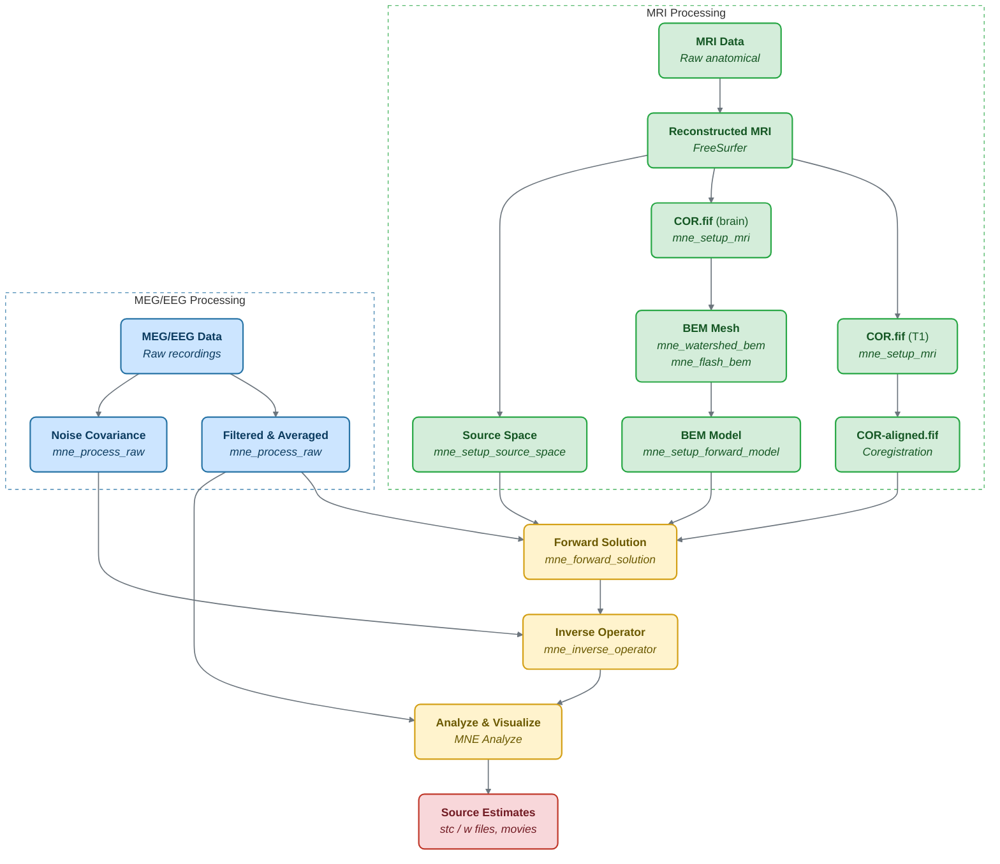

# The Typical MEG/EEG Workflow

## Overview

This section describes the typical MEG/EEG workflow — from raw data preprocessing through to source reconstruction — as originally outlined in the MNE-C manual cookbook (Hämäläinen, 2009). The workflow applies to both MNE-CPP command-line tools and the GUI applications.

The following diagram shows the complete workflow of the MNE software. The MRI processing path (left) and the MEG/EEG data path (right) converge at the forward solution computation.

*Figure: Workflow of the MNE software, adapted from the MNE-C manual (Hämäläinen, 2009). The MRI processing stages (green) are independent of the MEG/EEG data (blue) until the forward solution computation (yellow).*

### Processing Stages at a Glance

The main processing stages are:

1. **Setting up the analysis environment** — Configure `SUBJECTS_DIR`, FreeSurfer paths, and the analysis directory structure.
2. **Anatomical processing** — FreeSurfer reconstruction, source space creation, BEM mesh generation.
3. **Preprocessing** — Bad channel marking, filtering, downsampling, artifact suppression (SSP/ICA).
4. **Epoching and averaging** — Creating evoked responses from event-related data.
5. **Forward modeling** — Coordinate frame alignment, BEM model setup, forward solution computation.
6. **Inverse estimation** — Noise-covariance estimation, inverse operator construction.
7. **Source analysis** — Applying the inverse operator, visualization, morphing, group analysis.

:::tip
Steps 1–2 depend only on anatomical (geometrical) information and remain identical across different MEG/EEG studies on the same subject. Once the FreeSurfer reconstruction and BEM setup are complete, they can be reused for all experiments with that subject.
:::

## Setting Up the Analysis Environment

Before starting the data analysis:

1. **Set `SUBJECTS_DIR`** — Set the environment variable `SUBJECTS_DIR` to the directory containing the anatomical MRI data (FreeSurfer subject directories). Optionally, set `SUBJECT` to the name of the current subject's MRI directory under `SUBJECTS_DIR`. With this setting you can avoid entering the `--subject` option common to many MNE programs and scripts.

2. **Set up FreeSurfer** — Ensure the FreeSurfer environment is configured before using MNE software. The FreeSurfer and MNE software are complementary tools.

3. **Create an analysis directory** — It is recommended to create a new directory for the MEG/EEG data processing. Raw data files should be linked (using `ln -s`) rather than copied. On-line averages can be either copied or linked.

:::note
In the following sections, files in the FreeSurfer directory hierarchy are usually referred to without specifying the leading directories. Thus, `bem/subject-src.fif` refers to `$SUBJECTS_DIR/$SUBJECT/bem/subject-src.fif`.
:::

## Preprocessing

The following MEG and EEG data preprocessing steps are recommended:

- Bad channels in the MEG and EEG data must be identified and marked.
- The data has to be filtered to the desired passband.
- Artifacts should be suppressed (e.g., using SSP or ICA).

### Marking Bad Channels

Sometimes some MEG or EEG channels are not functioning properly for various reasons. These channels should be excluded from analysis by marking them as bad.

It is especially important to exclude flat channels (channels that do not show a signal at all) from the analysis, since their noise estimate will be unrealistically low and thus the current estimate calculations will give a strong weight to the zero signal on the flat channels, causing the estimates to essentially vanish. It is also important to exclude noisy channels because they can affect others when signal-space projections or EEG average electrode reference is employed. Noisy bad channels can also adversely affect averaging and noise-covariance matrix estimation by causing unnecessary rejections of epochs.

**Recommended ways to identify bad channels:**

- Observe the quality of data during data acquisition and make notes of observed malfunctioning channels to your measurement protocol sheet.
- View the on-line averages and check the condition of the channels.
- Compute preliminary off-line averages with artifact rejection, SSP/ICA, and EEG average electrode reference computation off and check the condition of the channels.
- View raw data and identify bad channels visually.

:::tip
It is strongly recommended that bad channels are identified and marked in the original raw data files. If present in the raw data files, the bad channel selections will be automatically transferred to averaged files, noise-covariance matrices, forward solution files, and inverse operator decompositions.
:::

### Artifact Suppression

#### Signal-Space Projection (SSP)

The Signal-Space Projection (SSP) is one approach to rejection of external disturbances in software. Unlike many other noise-cancellation approaches, SSP does not require additional reference sensors to record the disturbance fields. Instead, SSP relies on the fact that the magnetic field distributions generated by the sources in the brain have spatial distributions sufficiently different from those generated by external noise sources. Furthermore, it is implicitly assumed that the linear space spanned by the significant external noise patterns has a low dimension.

For a detailed mathematical description of the SSP method, see [Signal-Space Projection](ssp).

#### Independent Component Analysis (ICA)

Many MEG/EEG signals including biological artifacts reflect non-Gaussian processes. Therefore, PCA-based artifact rejection may perform worse at separating the signal from noise sources. ICA-based approaches provide an alternative method for separating neural activity from artifacts such as eye blinks, cardiac activity, and muscle artifacts.

### Downsampling

The minimum practical sampling frequency of the Vectorview system is 600 Hz. Lower sampling frequencies are allowed but result in elevated noise levels in the data. It is advisable to lowpass filter and downsample large raw data files — common in cognitive and patient studies — to speed up subsequent processing. This can be accomplished with [`mne_process_raw`](tools-process-raw).

It is recommended that the original raw file is called `<name>_raw.fif` and the downsampled version `<name>_ds_raw.fif`.

## Epoching and Evoked Data

Epoching of raw data is done using events, which define a `t=0` for data segments. Event times stamped to the acquisition software can be extracted from the raw data file. The events array can then be modified, extended, or changed if necessary.

Once epochs are constructed with appropriate rejection thresholds, they can be averaged to obtain evoked response data.

:::note
The rejection thresholds are defined in T/m for gradiometers, T for magnetometers, and V for EEG and EOG channels.
:::

### Rejection Using Annotations

Bad segments of data can also be rejected by marking segments of raw data with annotations, providing an alternative to peak-to-peak threshold-based rejection.

## Source Localization

MNE makes extensive use of the FreeSurfer file structure for analysis. Before starting data analysis, set up the environment variable `SUBJECTS_DIR` to select the directory under which the anatomical MRI data are stored.

### Anatomical Information

#### Cortical Surface Reconstruction with FreeSurfer

The first processing stage is the creation of various surface reconstructions with FreeSurfer. The recommended FreeSurfer workflow is summarized on the [FreeSurfer wiki](https://surfer.nmr.mgh.harvard.edu/fswiki/RecommendedReconstruction).

#### Setting Up the Source Space

This stage consists of:

- Creating a suitable decimated dipole grid on the white matter surface.
- Creating the source space file in FIFF format.

The following table shows recommended subdivisions for the creation of source spaces. The approximate source spacing and corresponding surface area have been calculated assuming a 1000-cm² surface area per hemisphere.

| Spacing | Sources per hemisphere | Source spacing (mm) | Surface area per source (mm²) |
|---|---|---|---|
| `oct5` | 1026 | 9.9 | 97 |
| `ico4` | 2562 | 6.2 | 39 |
| `oct6` | 4098 | 4.9 | 24 |
| `ico5` | 10242 | 3.1 | 9.8 |

### Creating the BEM Model Meshes

Calculation of the forward solution using the boundary-element model (BEM) requires that the surfaces separating regions of different electrical conductivities are tessellated with suitable surface elements. The MNE BEM software employs triangular tessellations. Prerequisites for BEM calculations are the segmentation of the MRI data and the triangulation of the relevant surfaces.

For **MEG computations**, a reasonably accurate solution can be obtained by using a single-compartment BEM assuming the shape of the intracranial volume.

For **EEG**, the standard model contains the intracranial space, the skull, and the scalp.

Two approaches are available in MNE-CPP:
- **[mne_watershed_bem](tools-watershed-bem)** — Creates BEM surfaces using FreeSurfer's watershed algorithm
- **[mne_flash_bem](tools-flash-bem)** — Creates BEM surfaces using multi-echo FLASH MRI sequences

#### Head Surface Triangulation Files

The segmentation algorithms produce either FreeSurfer surfaces or triangulation data in text. Before proceeding to the creation of the boundary element model, the following standard FreeSurfer surface files must be present:

1. **inner_skull.surf** — Contains the inner skull triangulation
2. **outer_skull.surf** — Contains the outer skull triangulation
3. **outer_skin.surf** — Contains the head surface triangulation

### Setting Up the BEM

This stage sets up the subject-dependent data for computing the forward solutions using **[mne_setup_forward_model](tools-setup-forward-model)**.

This step assigns the conductivity values to the BEM compartments:

| Compartment | Default conductivity (S/m) |
|---|---|
| Scalp | 0.3 |
| Skull | 0.006 |
| Brain | 0.3 |

The default skull conductivity ratio is 1:50 relative to scalp/brain. Recent publications report a range of skull conductivity ratios from 1:15 to 1:50. The MNE default ratio 1:50 is based on the typical values reported in the literature, since the approach is based on comparison of SEF/SEP measurements in a BEM model. The variability across publications may depend on individual variations but, more importantly, on the precision of the skull compartment segmentation.

:::note
To produce single layer BEM models use the `--homog` flag in `mne_setup_forward_model`. This is suitable for MEG-only analyses.
:::

After the BEM is set up, it is advisable to check that the BEM model meshes are correctly positioned.

:::note
Up to this point all processing stages depend on the anatomical (geometrical) information only and thus remain identical across different MEG studies.
:::

### Aligning Coordinate Frames

The calculation of the forward solution requires knowledge of the relative location and orientation of the MEG/EEG and MRI coordinate systems (see [The Forward Solution — Coordinate Systems](forward#megeeg-and-mri-coordinate-systems)). The head coordinate frame is defined by identifying the fiducial landmark locations, making the origin and orientation of the head coordinate system slightly user dependent. As a result, it is safest to reestablish the definition of the coordinate transformation computation for each experimental session, i.e., each time when new head digitization data are employed.

The coregistration is stored in a `-trans.fif` file.

:::warning
This step is important. If the alignment of the coordinate frames is inaccurate, all subsequent processing steps suffer from the error. Therefore, this step should be performed by the person in charge of the study or by a trained technician. Written or photographic documentation of the alignment points employed during the MEG/EEG acquisition can also be helpful.
:::

### Computing the Forward Solution

After the MRI-MEG/EEG alignment has been set, the forward solution — the magnetic fields and electric potentials at the measurement sensors and electrodes due to dipole sources located on the cortex — can be calculated using **[mne_forward_solution](tools-forward-solution)**.

### Computing the Noise-Covariance Matrix

The MNE software employs an estimate of the noise-covariance matrix to weight the channels correctly in the calculations. The noise-covariance matrix provides information about field and potential patterns representing uninteresting noise sources of either human or environmental origin.

The noise covariance matrix can be calculated in several ways using **[mne_process_raw](tools-process-raw)**:

- **From epochs**: Employ the individual epochs during off-line averaging to calculate the full noise covariance matrix. This is the recommended approach for evoked responses. Use the `--cov` option with a covariance description file.

- **From empty room data**: Employ empty room data (collected without the subject) to calculate the full noise covariance matrix. This is recommended for analyzing ongoing spontaneous activity.

- **From continuous raw data**: Employ a section of continuous raw data collected in the presence of the subject. This is the recommended approach for analyzing epileptic activity. The data should be free of technical artifacts and epileptic activity of interest. The length of the data segment should be at least 20 seconds.

### Calculating the Inverse Operator

The MNE software doesn't calculate the inverse operator explicitly but rather computes an SVD of a matrix composed of the noise-covariance matrix, the result of the forward calculation, and the source covariance matrix. This approach has the benefit that the regularization parameter (SNR) can be adjusted easily when the final source estimates or dSPMs are computed.

For mathematical details, see [The Minimum-Norm Estimates](inverse).

### Creating Source Estimates

Once all the preprocessing steps described above have been completed, the inverse operator can be applied to the MEG and EEG data and the results can be viewed and stored in several ways:

- The interactive analysis tool **[MNE Analyze](analyze)** can be used to explore the data and to produce quantitative analysis results, screen snapshots, and movies.

- The command-line tool **[mne_compute_raw_inverse](tools-compute-raw-inverse)** can be used to produce files containing source estimates at selected ROIs. The input data file can be either a raw data or evoked response MEG/EEG file.

- Source estimates are stored in **stc** (source time course) and **w** (snapshot) file formats for subsequent processing, morphing, and visualization.

### Group Analyses

Group analysis is facilitated by morphing source estimates to a common template brain (e.g., `fsaverage`). Subject-to-subject morphing enables cross-subject averaging and comparison of data among subjects. It is also possible to average the source estimates across subjects after morphing to a common surface space.

## References

- Esch, L., Dinh, C., Larson, E., Engemann, D., Jas, M., Khan, S., Gramfort, A., & Hämäläinen, M.S. (2019). MNE: Software for Acquiring, Processing and Visualizing MEG/EEG Data. *Magnetoencephalography: From Signals to Dynamic Cortical Networks*, 2nd Edition. Springer. DOI: [10.1007/978-3-319-62657-4_59-1](https://doi.org/10.1007/978-3-319-62657-4_59-1)
- Hämäläinen, M.S. (2009). *MNE Software User's Guide*. Martinos Center for Biomedical Imaging, Massachusetts General Hospital.
- Gramfort, A., Luessi, M., Larson, E., Engemann, D.A., Strohmeier, D., Brodbeck, C., Goj, R., Jas, M., Brooks, T., Parkkonen, L., & Hämäläinen, M. (2013). MEG and EEG data analysis with MNE-Python. *Frontiers in Neuroscience*, 7, 267. DOI: [10.3389/fnins.2013.00267](https://doi.org/10.3389/fnins.2013.00267)
- Gramfort, A., Luessi, M., Larson, E., Engemann, D.A., Strohmeier, D., Brodbeck, C., Parkkonen, L., & Hämäläinen, M.S. (2014). MNE software for processing MEG and EEG data. *NeuroImage*, 86, 446–460. DOI: [10.1016/j.neuroimage.2013.10.027](https://doi.org/10.1016/j.neuroimage.2013.10.027)
